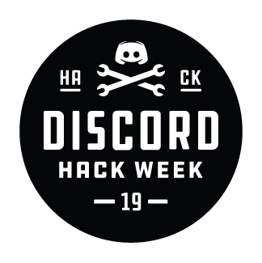

# WumpoBot 

Bot that posts one out of many fan-arts/pictures/gifs regarding Discord's mascot, Wumpus.

## Status

> ONLINE: there might be short downtimes for maintenance or network issues.

## Invite WumpoBot to your own server

- https://discordapp.com/oauth2/authorize?client_id=593089411965517844&scope=bot&permissions=0

> alternatively through [discordbots.org](https://discordbots.org/bot/593089411965517844).

## Run the bot locally

Modified version of the very clear and well written guide by Emzi0767, DSPlus dev.

### Creating a Discord application
1. Go to [my applications](https://discordapp.com/developers/applications/me) page on Discord Developer portal.
2. Press the **new app** button.
3. **New app** page will open. Enter your bot's name in the **app name** field, and its description in the **description** field.
   * You can optionally give it an avatar by pressing on the **avatar** button.
4. When you're done, press the **create app** button.
5. When the app is created, press the **create bot user** button.
6. Once this is done, you will need to copy the **bot's token**. Under **app bot user**, there's a **token** field, press **click to reveal** and copy **the resulting value**.

### Building the project and configuring the bot
1. Download the project, open the solution and compile it.
   * In order to compile you will need to download the project's NuGet dependencies first. In VisualStudio press the tab control **Tools**, then **NuGet Package Manager** and finally it will appear a popup with **Restore**.
2. Go to `<project path>`, and copy the `example.config.json` file from the root to the build folder and rename it to `config.json` instead.
3. Open it with Notepad/Notepad++/Any notepad application. Replace the placeholder values (do not remove the quotes) with your actual application's token, command prefix and color value in HEX format. Save it.
4. WumpoBot is now configured, but you need to invite it to a server first.

### Adding the bot to your server
1. Go back to your app page, and copy your bot's **client ID**.
2. Go to `https://discordapp.com/oauth2/authorize?client_id=your_app_id_here&scope=bot&permissions=0`.
3. On the selected page, select **your server**, and press **authorize** (CAPTCHA check will follow).
4. Done! Let's run the bot.

### Running the WumpoBot
1. Go back to VisualStudio and hit **Start**.
2. Congratulations! Your bot is now running on a local instance on your machine!

#### All future changes made to client IDs or tokens should be reflected likewise this guide.

## Command Sets

Currently the bot features only 2 command sets that fill it's purposes but many others can be freely added plugin-like.

The prefix to insert before each command should be defined in the configuration file, default character is "!".

- Image
	- wumpus: posts a picture of Wumpus, random(ish) everytime
	- submit: posts the google form to submit new medias
- Miscellaneous
	- version: posts the current deployment version and credits
	- getwumpobot: posts a WumpoBot's invite link 
	- gone `<Mention>`: `<Mention>` is gone :crab: ([*related*](https://www.youtube.com/watch?v=LDU_Txk06tM))

## Contribute

Currently the bot features **17** distinct items, you can submit new Wumpus' fan-arts/pictures/gifs through this [google form](https://forms.gle/3QpkMpvJopbDZ5uE8).

In the future there is going to be a list of every media used to avoid duplicates.

The bot is and will continue to be **free** for everyone, if you'd like to donate to keep the bot running let me know.
	
## Credits

In accordance, WumpoBot complies with the Digital Millennium Copyright Act (DCMA) and World Intellectual Property Organization (WIPO).

If any featured fan-arts/pictures/gifs is wrongfully credited or you, as rightful owner, want it removed, let me know.

